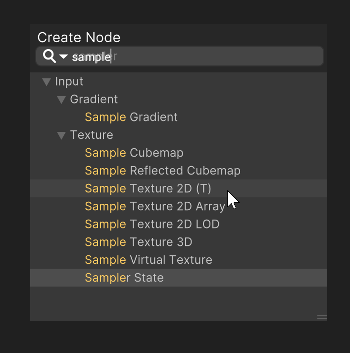
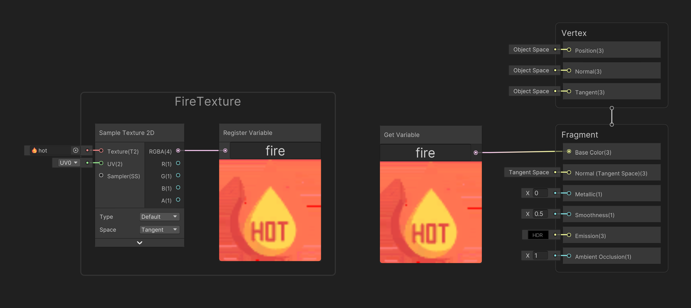

# ShaderGraphHotKey 1.4.2
유니티 외장 플러그인 중 엠플리파이 쉐이더는 단축키 기능을 제공하고 있으며, 이는 매우 편한 기능입니다.
유니티에서 제공하는 쉐이더 그래프는 아쉽게도 단축키를 제공하지 않고 있는데요.

이 에셋은 유니티 쉐이더 그래프에 엠플리파이 쉐이더와 동일하거나 비슷한 단축키 경험을 제공합니다.

# 유니티 호환 버전
### 2021.2 or Higher
Unity 2021.3 LTS ✅
Unity 2022 ✅

# 다운로드
### 유니티 패키지 -> [UnityPackage](https://github.com/NK-Studio/ShaderGraphHotKey/releases) 다운로드

# 기타

현재 1.x.x으로 올라온 패키지는 Lite 버전이며 추후에 원하는 단축키로 변경할 수 있도록 인풋 매니저 또한 제공 준비중입니다.

사용법은 PDF로 유니티 패키지에 수록되어 있으며 영상강의는 추후에 진행하도록 하겠습니다.

# 기능
### HotKey (단축키)
   
이 에셋의 메인 기능인 단축키 기능을 제공합니다.

   
단축키가 적용된 노드들은 검색했을 때 힌트가 표시됩니다.

### Register Node & Get Variable Node (노드 로컬 변수 & 불러오기)
   
노드를 변수처럼 저장하여 원하는 위치에서 노드를 불러와서 사용할 수 있습니다.

### Screenshot (스크린 샷)
   
쉐이더 그래프에 추가된 Screenshot 버튼을 클릭하여 노드를 스크린 샷 할 수 있습니다.

# 단축키 표
|노드 이름|단축키|
|------|---|
|IntegerNode|숫자 0|
|Vector1Node|숫자 1|
|Vector2Node|숫자 2|
|Vector3Node|숫자 3|
|Vector4Node|숫자 4|
|ColorNode|숫자 5|
|SampleTexture2DNode|T|
|UVNode|U|
|AddNode|V|
|SubtractNode|S|
|MultiplyNode|M|
|DivideNode|D|
|OneMinusNode|O|
|PowerNode|E|
|LerpNode|L|
|SplitNode|B|
|SwizzleNode|Z|
|NormalizeNode|N|
|DotProductNode|. (점)|
|Register Variable|R|
|Get Variable|G|

단축키를 변경할 때 A,F,O키를 조심하십시오.
유니티 고유 단축키여서.. 충돌 문제 발생.
